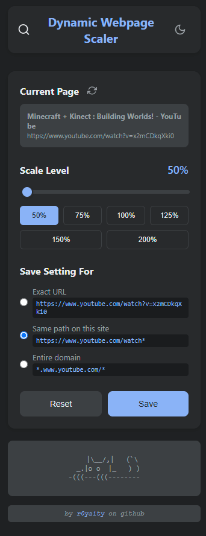

# Dynamic Webpage Scaler

A Chrome extension that allows users to dynamically adjust webpage zoom levels with a beautiful, modern interface.

  
   
  <em>Dynamic zoom level adjustment with a beautiful UI</em>

## Features

- Dynamic zoom level adjustment with a smooth slider
- Quick preset zoom levels (50% to 200%)
- Pattern-based zoom settings (exact URL, path, or domain)
- Dark/Light theme support
- Beautiful UI with smooth animations
- ASCII art cats that change with the theme

## Installation

1. Clone this repository
2. Open Chrome and go to `chrome://extensions/`
3. Enable "Developer mode" in the top right
4. Click "Load unpacked" and select the extension directory

## Development

The extension consists of the following main components:

- `manifest.json`: Extension configuration
- `sidepanel.html`: Main UI interface
- `sidepanel.js`: Sidepanel functionality
- `content.js`: Content script for webpage interaction
- `background.js`: Background script for extension management

## Contributing

Feel free to submit issues and enhancement requests!

## License

GPL-2.0 license - feel free to use this project for your own purposes but not to distribute commercially.

## Author

[r0ya1ty](https://github.com/r0ya1ty) on GitHub 
